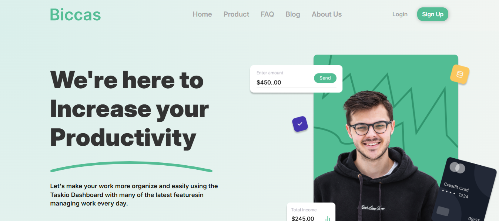

# Biccas

## ✨ Overview

Biccas is a responsive front-end web page designed according to a Figma design. This project showcases a modern and professional user interface aimed at improving productivity through a variety of features. Developed using HTML, CSS, and JavaScript, Biccas serves as a landing page for a productivity tool with a sleek design and user-friendly navigation.

<div align="center">
   
</div>

---

## 📜 Table of Contents

- [Demo](#🌐-demo)
- [Features](#🚀-key-features)
- [Technologies Used](#🛠️-technical-features)
- [Installation](#🛠️-installation--setup)
- [Usage](#usage)
- [Project Structure](#📂-project-structure)
- [License](#📜-license)

## 🌐 Demo

Check out the live version of Biccas here: [Biccas Live Demo](https://ahmedalsanadi.github.io/Biccas-Landing-Page-Ahmed-Al-Sanadi/)

## 🚀 Key Features

- **Responsive Design:** Optimized for various devices and screen sizes.
- **Navigation:** Includes a multi-link navbar with options such as Home, Product, FAQ, Blog, and About Us.
- **Hero Section:** Features a hero banner with a call-to-action button for a free trial and a demo link.
- **Collaboration Section:** Showcases popular brands using the platform.
- **Rating Section:** Displays customer ratings and supportive features like publishing, analytics, and engagement.
- **Feature Section:** Highlights Biccas’s main features, such as team collaboration, cloud storage, and daily analytics.
- **Benefits Section:** Lists benefits like free consulting, online banking, and monthly investment reports.

## 🛠️ Technical Features

- **HTML5:** Structuring the content on the page.
- **CSS3:** Styling the website with custom classes, flexbox, and grid for layout.
- **JavaScript:** Enhancing interactivity (such as the mobile menu toggle and other actions).

## 🛠️ Installation & Setup

To get a local copy of the project up and running, follow these steps:

1. Clone the repository:
    ```bash
    git clone https://github.com/ahmedalsanadi/Biccas-Landing-Page-Ahmed-Al-Sanadi
    ```

2. Navigate to the project directory:
    ```bash
    cd Biccas-Landing-Page-Ahmed-Al-Sanadi
    ```

3. Open `index.html` in your browser to view the website.

## Usage

- The project is designed for educational purposes, demonstrating HTML, CSS, and JavaScript integration.
- You can use the codebase to learn or experiment with responsive design techniques and modern web UI layout practices.
- Feel free to modify the code to meet your personal or project needs.

## 📂 Project Structure

```
Biccas/
├── index.html       # Main HTML file
├── style.css        # CSS file for styling the webpage
├── script.js        # JavaScript file for interactive features
└── images/          # Folder containing all images used in the project
```

## 📜 License

This project is licensed under the MIT License - see the [LICENSE](./LICENSE) file for details.

---

<div align="center">
  Made with ❤️ by [Ahmed Al-Sanadi]
  
  ⭐ Star this repo if you find it helpful!
</div>

---